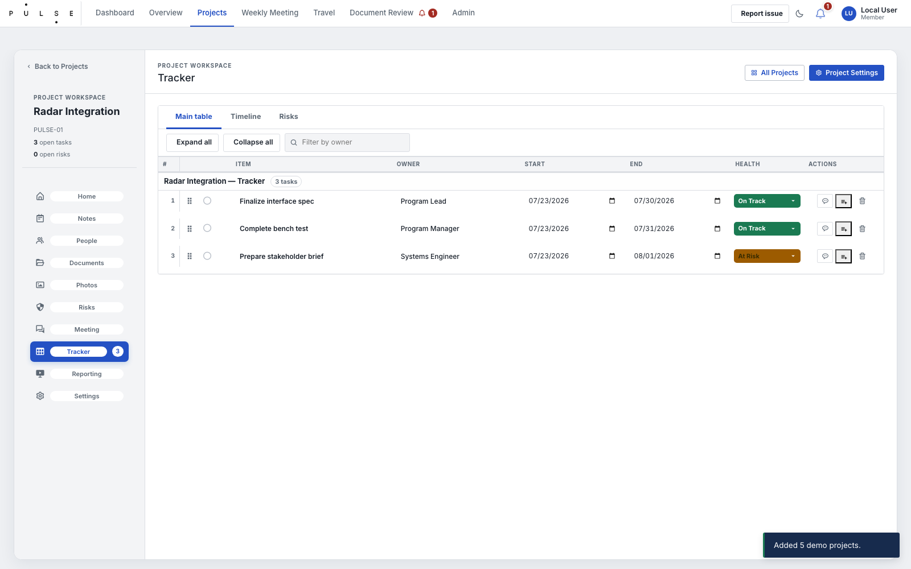
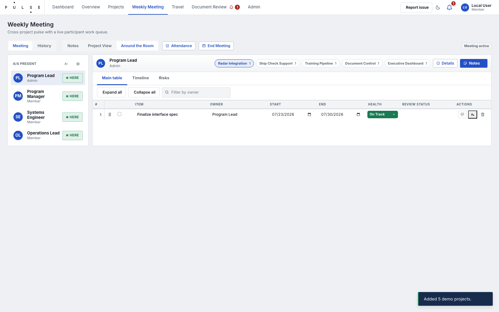
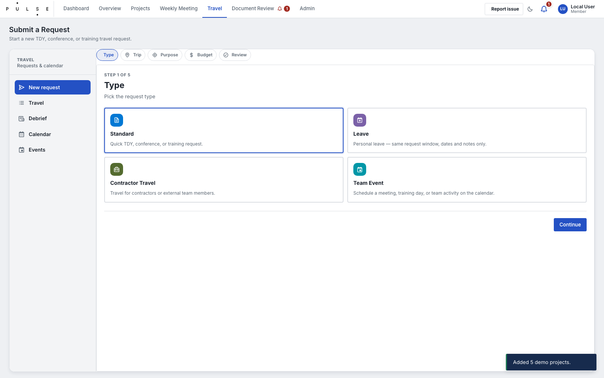
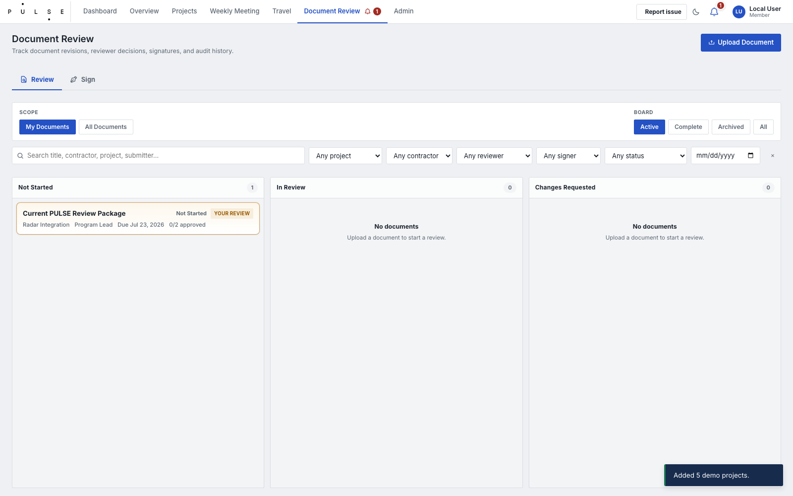
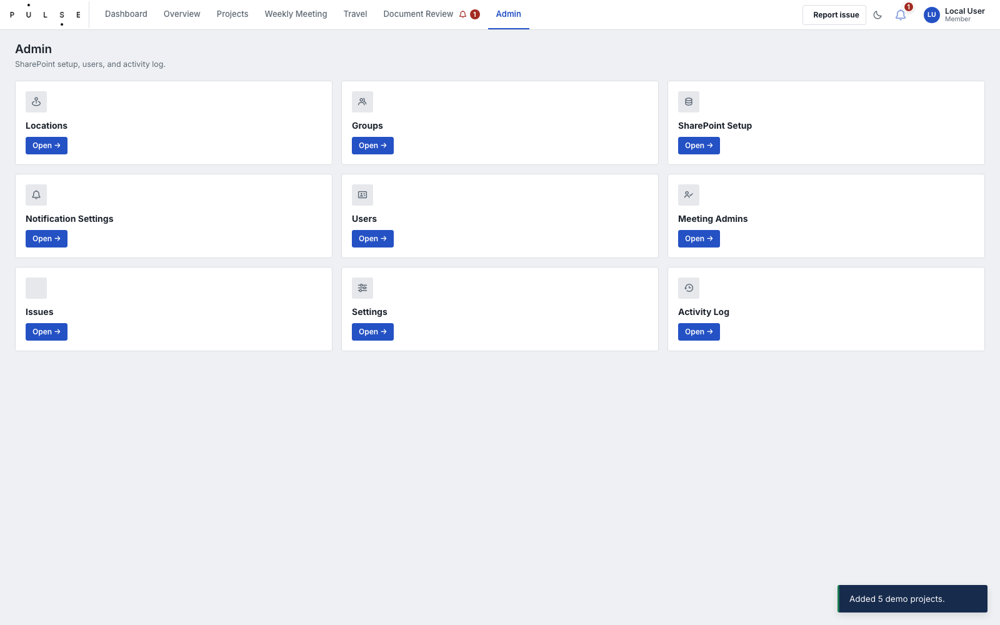

# PULSE Operations SOP

## 1. Project workflow

1. Navigate to **Projects** and click **New Project**.
2. Enter **Project name** (reader-facing), **Portfolios**, and a concise **Description**.
3. Add **Members** via the people picker to establish the initial roster. (Optionally add a cover image).
4. Save the project, then open it to configure **Settings**: set the **Lifecycle status**, **Technical health**, and essential **Dates** (start, due, completion).
5. For tracker work, assign each task to an owner and define the **Start date**, **Due date**, **Action status**, and **Health**.
6. If a task is Blocked, you must enter the dependency in the **Blocked reason**. If On Hold, enter the **On-hold reason**.
7. Create **Risk** entries with a defined likelihood, impact, category, mitigation plan, and owner.

A project is operationally current only when active work has owners and dates and red/amber conditions have a documented recovery action.

## 2. Meeting workflow

Use **Weekly Meeting** for the general series or **Project → Meeting** for a project-scoped session. Maintain meeting date, series, attendees, agenda, notes, decisions, action items, carry-forward work, risk changes, project status changes, and session status.

1. Confirm session scope, date, series, and roster.
2. Review rocks, tracker work, risks, and carry-forward items.
3. Record decisions separately from general notes.
4. Create or update a tracker item for every actionable follow-up.
5. End the session only after actions are owned and dated in the tracker.

## 3. Travel workflow

Start at **Travel → New Request**. Select the right request type, then enter trip title, travelers, destination, dates/times, purpose, impact if not approved, related project, travel type, estimate, alternatives, and notes. Engineering travel also requires its additional location, date, traveler, transportation, and funding detail.

The requester submits and monitors in **My Travel**. Status is **Pending**, then **Pending Finance** after approver approval, then **Approved** after finance records the charge object. An approver can deny with a denial reason; pending requests may be revoked, and approved requests may be cancelled. Each traveler completes a separate debrief with trip dates, systems/subjects, classification, summary, and follow-up.

## 4. Document Review workflow

1. Navigate to **Document Review** and click **New Review**.
2. Select the related **Project**, document type, and kind. Provide the **Title**, **Due Date**, and **Revision Label** (e.g. v1.0).
3. Upload the **Current File** representing the version to be reviewed.
4. Add **Reviewers** (individuals or groups). If sequential signatures are required, designate specific reviewers as Signers.
5. Reviewers will receive notifications and must log their decision (Approved/Changes Requested) along with any actionable comments.
6. If changes are requested, the owner must update the local file, upload it as a new revision, and restart the review cycle for the new revision. Do not overwrite the approved revision.
7. Once all reviewers approve, the record enters **Review Complete**. If signatures are required, upload the **Final Pack** PDF to move it to **Awaiting Final Pack** and begin sequential signing.
8. Signers download the pack, sign externally, and upload the signed file to advance the record to **Signed**.

## 5. Administration workflow

In **Admin**, first confirm current-user and site diagnostics. Maintain active role records with user email, display name, role, job title, access selections, and notification preferences. Use the least-privileged applicable role. Set a departing user inactive rather than removing the record. Use **SharePoint Setup** to validate/provision required lists and fields; do not create ad hoc schema changes.

## Incident report

Capture time, workspace/route, record identifier, user role, field/action, expected result, actual result, browser/device, screenshot, and relevant log evidence.
