# PULSE User Guide

## Start a session

Open PULSE from the approved SharePoint page. PULSE uses the current SharePoint session; it has no separate password screen. The local browser fallback is for interface development only and is not an official record. Confirm the name and role shown at the top right, then review **Dashboard**, **My Work**, and relevant notifications.

## App shell and Dashboard

**Reach it:** select **Dashboard** or the PULSE mark. **Who can use it:** every associated user. **What you see:** the primary navigation, theme control, notifications, account menu, quick-access cards, My Work, and meeting actions.

Use a quick-access card or its secondary action to reach the corresponding module. Use **Report issue** to start a support ticket. Select the bell for notifications and select your account control for **Notification Settings**. Dashboard counts and items depend on records available to your role.

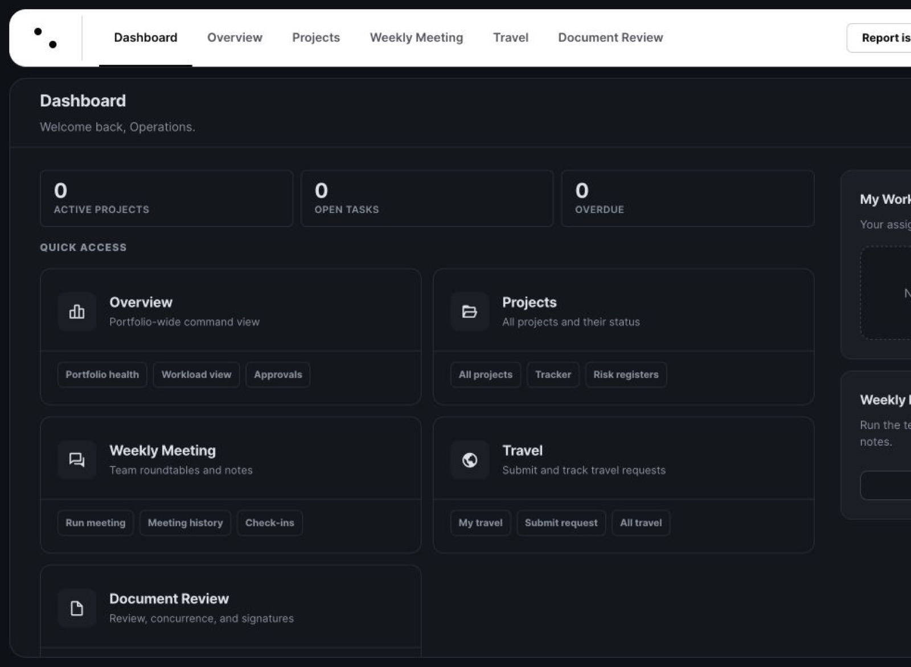

## My Overview and Team Overview

**Reach it:** **Overview**. **Purpose:** organize personal work and shared operational awareness. The available views include personal work, portfolio context, operations queue, resources, and workload. Use the view and filter controls to narrow information, then open the linked project or record to act.

Role restrictions apply to team-wide administration and to data outside the user's project access. Overview is a decision surface; edit the underlying project, tracker, review, travel, or meeting record rather than treating an overview card as the authoritative record.

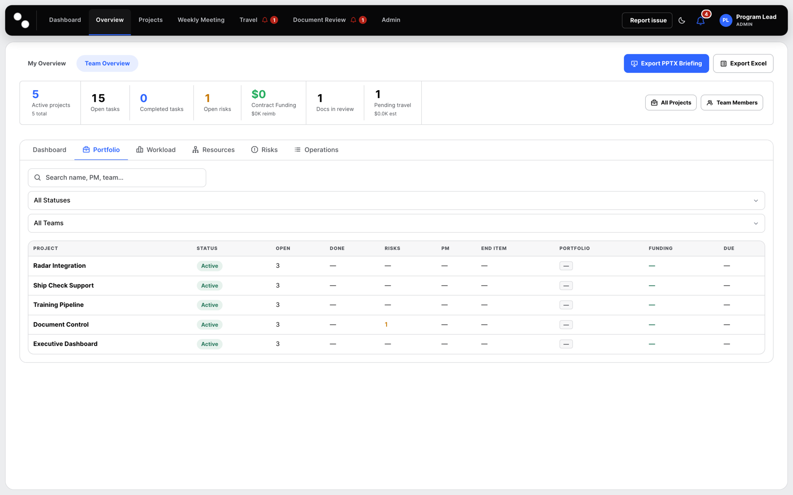

## Projects, Portfolios, Programs, and End Item Configurations

**Reach it:** **Projects**. **Purpose:** locate or create project workspaces and group work by portfolio, program, or end-item configuration. Use the project filters and group views to find a project. Authorized users can create a project and set its name, team, portfolios, ownership, dates, purpose, and related configuration.

Project lifecycle values shown in the current project settings are **Planned**, **Awaiting Funding**, **Active**, **Paused**, and **Complete**. Technical health is separately recorded as **On Track**, **At Risk**, or **Off Track**. Keep lifecycle, technical health, owners, dates, and recovery context current.

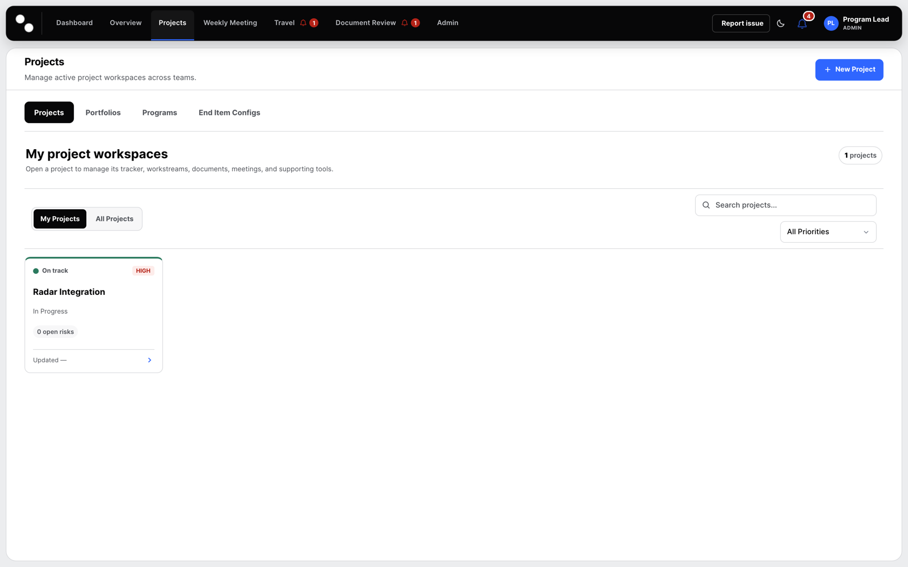

## Project workspace

Open a project from **Projects**. The workspace navigation exposes current project tools. Controls can vary by role and project access.

### Home

Use **Home** for the project summary, current condition, ownership, dates, and direct links. Confirm the project identity before editing. The Home view is a summary, not a replacement for tracker, risks, or formal review records.

### People

Use **People** to review or maintain the project roster, roles, contractors, and key contacts. Add people from the approved directory when authorized. Project membership does not by itself grant PULSE administrative privileges.

### Documents

Use **Documents** for project-associated files and links. Add files or references with clear names and context. Project document storage is distinct from **Document Review**. Start formal review only through the Document Review module.

### Tracker and Gantt

Use **Tracker** to create and maintain dividers, tasks, subtasks, owners, start dates, due dates, health, notes, and linked documents. The task workflow values are **Not Started**, **In Progress**, **On Hold**, **Blocked**, and **Complete**. A past due date is a calculated timing condition, not another task status. Explain a blocked dependency or a hold before relying on that state.

Use the Gantt view to inspect or maintain schedule placement and dependencies. A Gantt bar reflects tracker dates; update the work item record when timing changes. Do not move a visual bar without confirming the underlying start and due dates.

### Boards

Use **Boards** for project board work. A board can use table or Kanban presentation and starts with **To Do**, **In Progress**, and **Complete** columns; authorized owners may configure board columns and fields. Board completion is defined by the board's final configured column.

### Reporting

Use **Reporting** to prepare project reporting, milestones, technical bullets, risks, timelines, and PowerPoint output. Check all source records before generating. Browser-generated PowerPoint can download locally; when SharePoint mode is available, PULSE attempts project-file upload. Treat a generated file as a draft until its content and destination are verified.

### Meeting and Notes

Use **Meeting** for the project-scoped meeting view and **Notes** for project notes. Record decisions separately from general notes. Create a tracked action for any follow-up that has an owner or timing expectation.

### Tickets and Settings

Use project **Tickets** to create or review project-linked support items. Use **Settings** to maintain authorized project metadata, lifecycle, technical health, dates, reporting configuration, and related fields. Changes are recorded against the related PULSE record when SharePoint persistence succeeds.

## Weekly Meeting

**Reach it:** **Weekly Meeting**. **Purpose:** run the shared or project meeting cadence. Use the meeting views to maintain roster, agenda, rocks, attendance, notes, decisions, project updates, action items, carry-forward work, and history. Start or join the appropriate session, capture decisions as they occur, and convert each actionable follow-up into a named tracker item before the session ends.

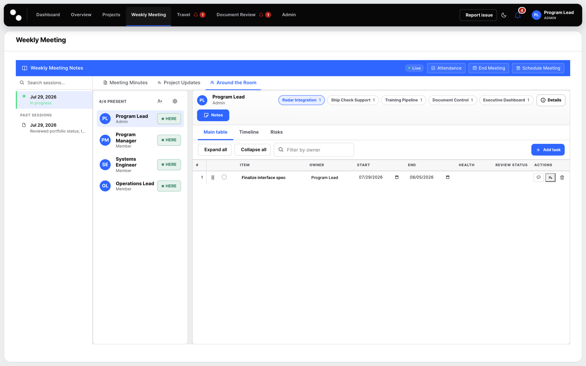

## Travel and debriefs

**Reach it:** **Travel**. **Purpose:** submit, monitor, approve, and record travel and debriefs. Use **New Request** to enter the request type, trip title, travelers, destination, dates and times, purpose, impact, project, travel type, estimate, alternatives, and notes. Engineering travel exposes additional fields where configured.

Request filtering includes **Pending**, **Pending Finance**, **Approved**, **Denied**, **Revoked**, and **Cancelled**. Requesters can monitor their own records. Approvers and finance users must use the applicable role-restricted actions and record required rationale or funding information. Each traveler records a separate debrief after travel.

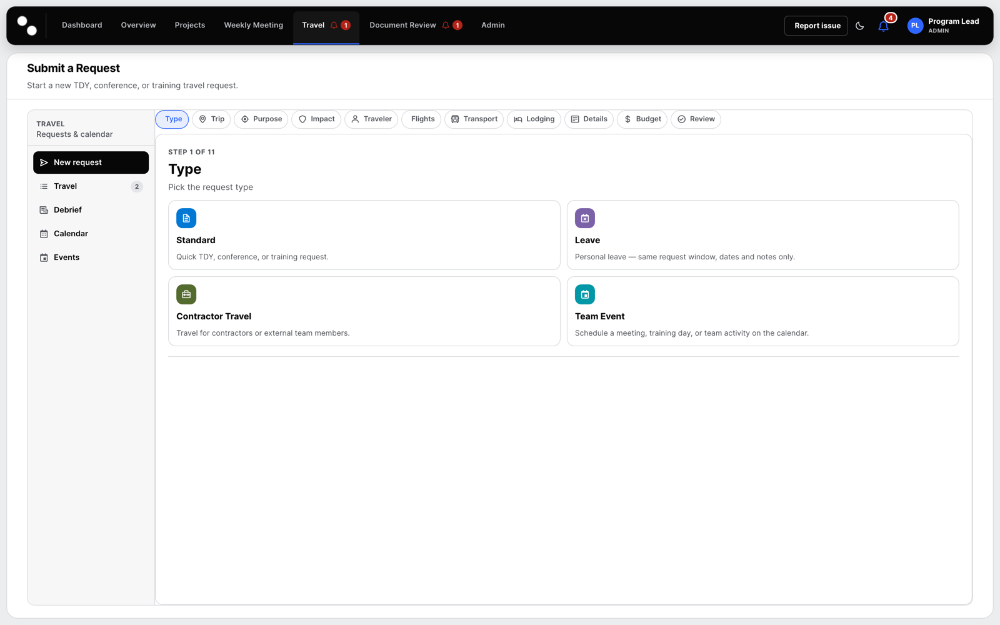

### My Travel

**Reach it:** **Travel → Travel**, then **My Travel**. **Purpose:** track only your own requests. Tabs narrow the list to **All**, **Upcoming**, **Submitted**, **Withdrawn**, **Cancelled**, and **Completed**. Each row shows your role on the trip, destination, dates, request status, concurrence and charge-object state, and whether a debrief is outstanding. Row actions cover viewing, editing, withdrawing, and adding the trip to a calendar. Switch to **All Travel** to see the team's trips where your role permits it.

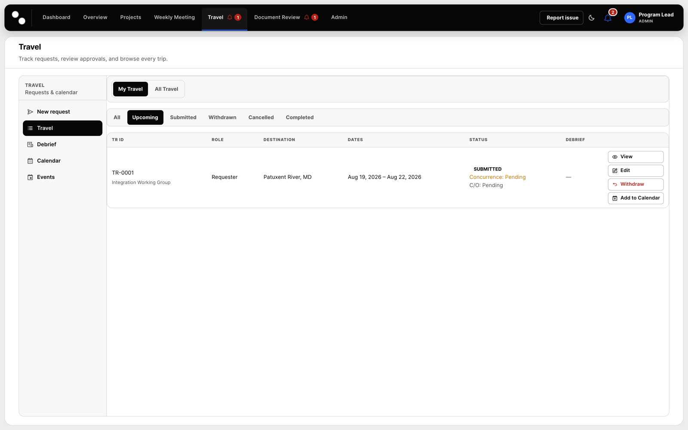

### Travel Calendar

**Reach it:** **Travel → Calendar**. **Purpose:** see team travel and team events together on one calendar to spot overlaps and coverage gaps before approving a request. **Events** manages the non-travel entries that appear alongside trips.

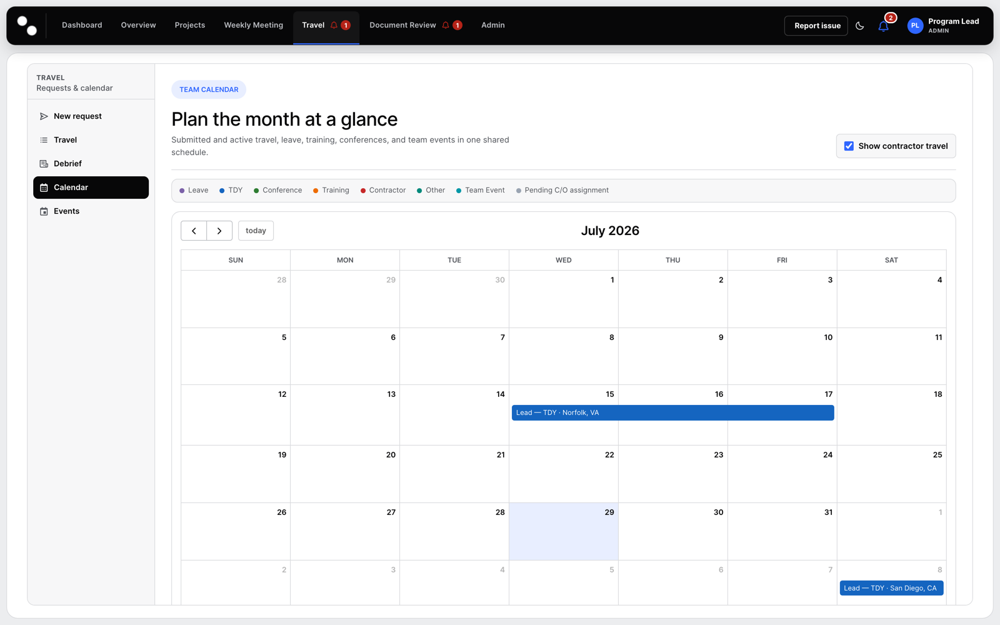

### Debrief

**Reach it:** **Travel → Debrief**. **Purpose:** record the post-trip debrief against an approved request. File one debrief per traveler; a trip with an outstanding debrief stays flagged in **My Travel**.

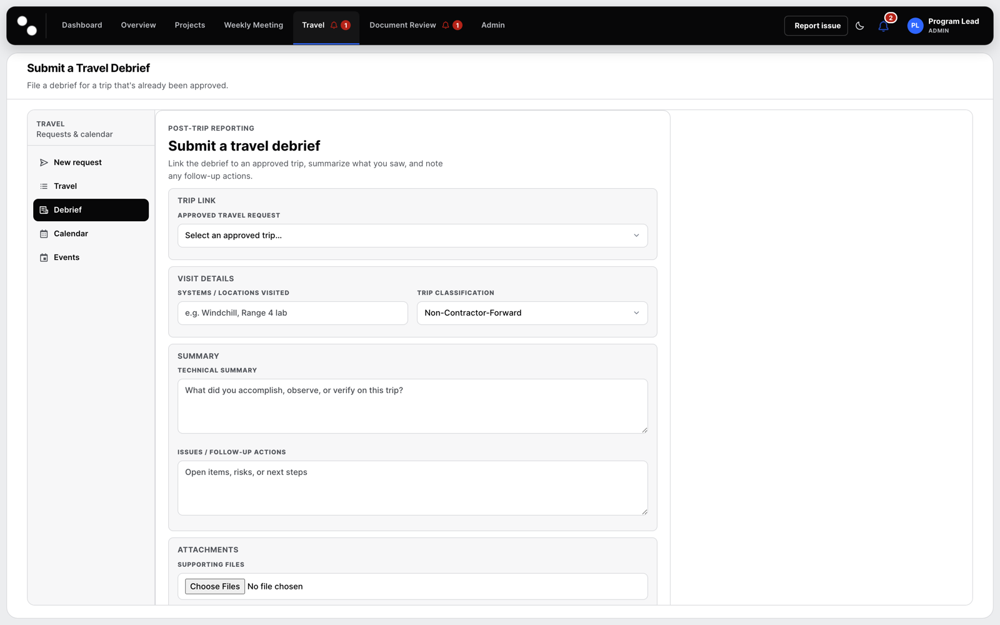

## Document Review

**Reach it:** **Document Review**. **Purpose:** manage formal review, concurrence, revision, final-pack, and signature activity. Create a review with the related project, type, title, due date, revision label, current file, and reviewers or reviewer groups. Add signers only where sequential signing is required.

Current review values are **Not Started**, **In Review**, **Changes Requested**, **Review Complete**, **Awaiting Final Pack**, **Signing in Progress**, **Signed**, and **Archived**. If changes are requested, upload a new revision and repeat review; do not overwrite the reviewed revision. A project document is not formally reviewed merely because it is stored in a project library.

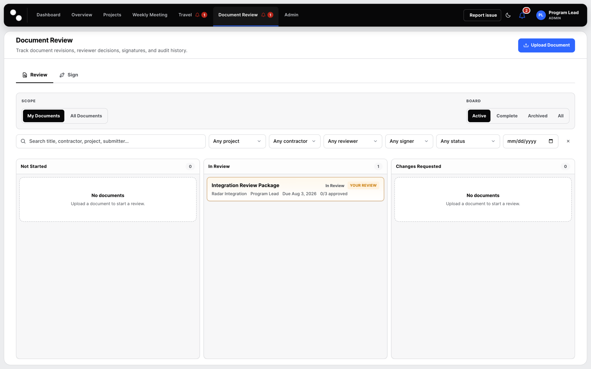

## Support Tickets

**Reach it:** **Report issue**, project **Tickets**, or the ticket route. **Purpose:** record support needs with a clear title, description, affected project where applicable, priority, reporter, and status. Ticket values are **Open**, **In Progress**, and **Resolved**. Include the route, record identifier, expected result, actual result, and an approved screenshot when reporting an issue.

Filter the list by status or type, or search by ticket identifier or title. Opening a ticket shows the description, any documented workaround and escalation path, and the update history; post updates there rather than by email so the record stays complete. Tickets and issue reports share one SharePoint list, so a ticket raised from the standalone Tickets tool is the same record the full application shows.

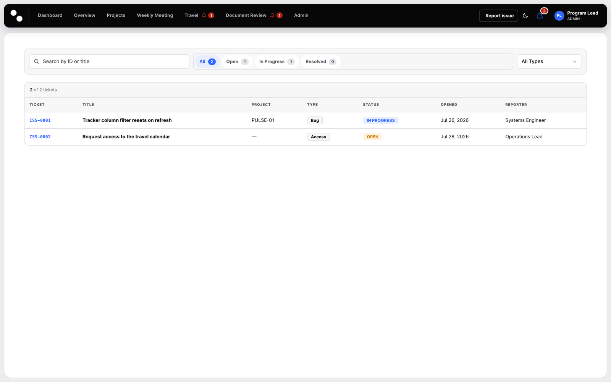

## Notifications

Use the bell to review notification items. **Notification Settings** controls subscribed areas, delivery channels, and message tone where enabled. Adjust preferences for your own account only; administrators maintain platform configuration. Notification visibility is not a substitute for checking the record itself.

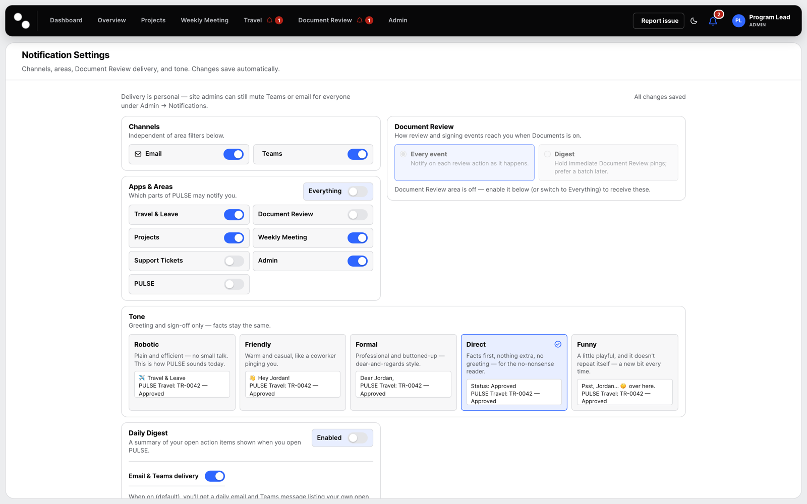

## Admin tools, users, roles, and activity

**Reach it:** **Admin**. **Who can use it:** PULSE administrators; other users may not see the administrative actions. Admin tools include diagnostics, SharePoint Setup, Users, role association, locations, configuration, activity logs, and related maintenance views.

Use **SharePoint Setup** to validate or provision the defined schema; do not create ad hoc lists or columns. In **Users**, associate approved people with PULSE, assign the least-privileged appropriate role, and deactivate records rather than removing audit context. Use the Activity Log to inspect recorded actions and support investigations.

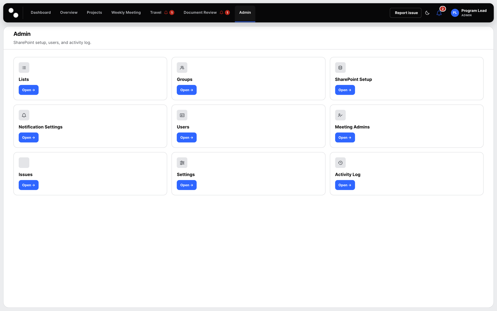

The Activity Log lists recorded actions with the actor, area, summary, route, and time.

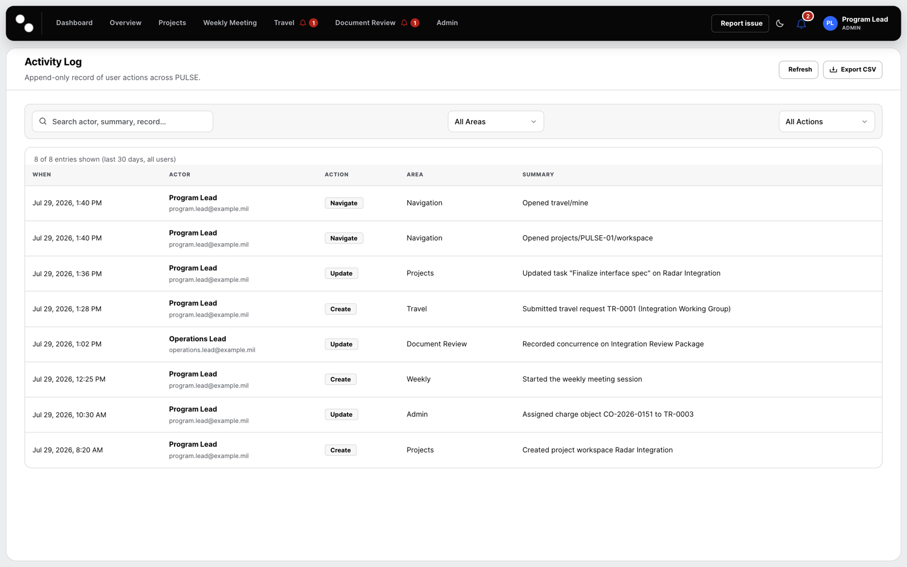

## Focused tools on their own pages

Besides the full application, a site owner can place a single-area PULSE tool on a SharePoint page: **Travel Request Forms**, **My Travel**, **Travel Calendar**, **Tickets**, **PULSE Calendar**, and this **Documentation** library. Each is the same application restricted to one area, reading and writing the same records, so work done in a focused tool appears in the full application and vice versa. Navigation is limited to that area by design — to reach anything else, open the full PULSE page.

If a focused tool shows local-only behavior and your records are missing, it could not resolve the SharePoint site. Open the full PULSE page once on the same site and reload the tool; if it still cannot connect, raise a ticket with the page address.

## Glossary

| Term | Meaning |
|---|---|
| Portfolio | Named grouping of related projects. |
| Program | Higher-level initiative that can span portfolios. |
| End Item Configuration | Delivered hardware or software configuration used for grouping and reporting. |
| Tracker | Project work items, owners, dates, health, notes, and subtasks. |
| Board | Configurable project work presentation, separate from the tracker. |
| Project Documents | Project-associated files and references. |
| Document Review | Formal review and signature workflow with its own lifecycle. |
| PULSE role | Active role record that determines administrative and feature access. |
| Activity Log | Record of application activity used for operational traceability. |
